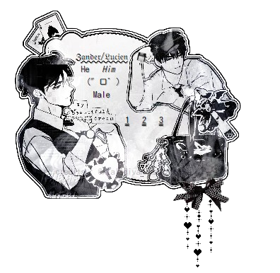
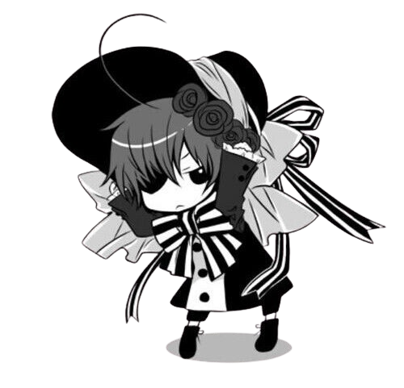
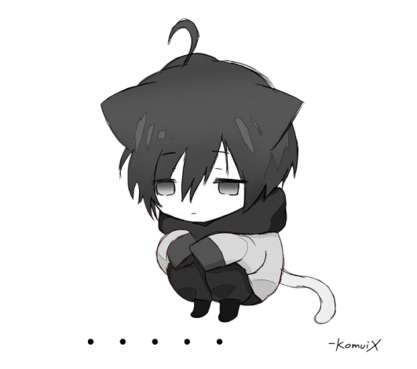

# 𝜗𝜚 ㅤ  ׅ    ۫   𐂯ᩙ᩠𓏼    ׄ   ♡゙    ̹ ̜ㅤ[ARLECCHIN.].

  

  

    
ㅤ         𓈒    ୭ৎ    ᥴᥲ𝗍s  ᥱyᥱs    𝅄          ۪   ݁   𓈒 

ㅤㅤ ۪      𝅄     ꒰  태형  ꒱    ۪   ݁  𝟷𝟷 : 𝟷𝟷   ݁   ۪    ୧

  ۫  ⊹     angel      命

  

  <!-- Minimal Dark Gothic Divider Line -->
  ིྀ 𓎟ᛝ𓎟𓎟　†　𓎟𓎟ᛝ𓎟 ྀི 

 

<!-- Main Profile Layout Grid with Dark Styling Borders -->

  

    
   
        Welcome 𝔱𝔬 𝔪𝔶 READ.ME .
  
      
      ⛓️ɴɪᴄᴋɴᴀᴍᴇ:  Zan, Fang ,  Noir , or Arlecchin
   ᴘʀᴏɴᴏᴜɴs:  he/ him ⊹ ࣪˖┆
     ᴀʙᴏᴜᴛ ᴍᴇ: ᴄᴀusᴜᴀʟ ᴘᴏɴʏᴛᴏᴡɴ sᴋɪɴ ᴅᴇsɪɢɴᴇʀ ⊹ ࣪˖┆
    <b> ᴜsᴜᴀʟ ʜᴀᴜɴᴛs ;  Chilling out .
      
        🛑DNI: ᴡᴇɪʀᴅ ᴘᴇᴏᴘʟᴇ , ᴏᴘs , ᴛᴏxɪᴄ ɪɴᴛᴇʀᴀᴄᴛɪᴏɴs , ᴋᴇᴇᴘ ᴛʜᴇ ᴠɪʙᴇs ᴄʜɪʟʟ. 

  </tr>
</table>

 

  

   Please don't be afraid to comment or anything, I may not see and I apologize for that, so you could whisper . ︵‿︵‿୨♡୧‿︵‿︵ </love>

  

  <i>"If you spot me lurking in-game, feel free to sit down and cuddle, or leave a follow right here."</i>

